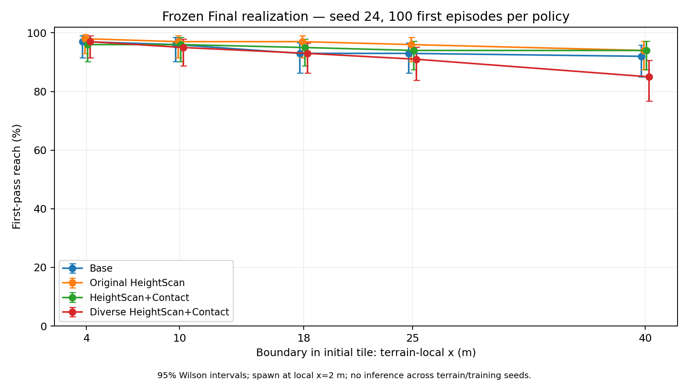
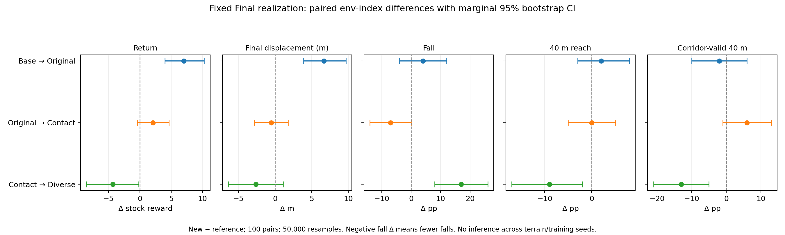
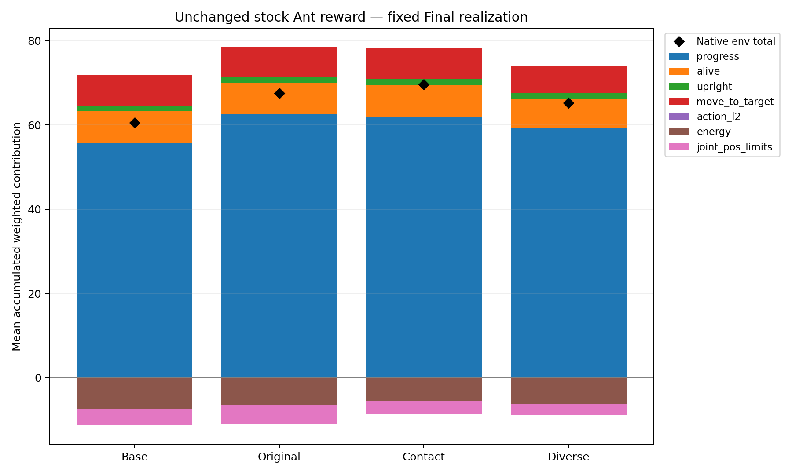
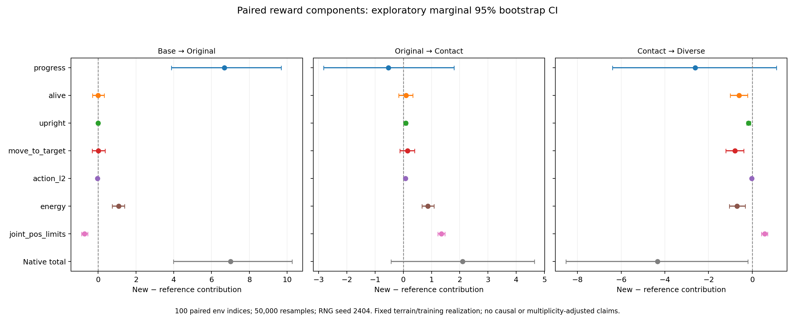

# IsaacLab Ant Locomotion for Unseen Terrain

본 프로젝트에서는 `Isaac-Ant-v0`를 기반으로, 학습 중 직접 보지 않은 지형에서도 안정적으로 이동하는 PPO policy를 개발하였다. Stock Ant의 robot 구조와 reward를 유지하면서 observation과 training terrain distribution을 변경하였다.

Terrain perception, foot contact feedback, training terrain diversity의 역할을 분리하기 위해 네 가지 정책을 비교하였다. 개발 환경과 구분된 analytic Final unseen course에서 동일한 조건으로 평가하고, 이동량·완주·안정성·reward component를 함께 분석하였다.

## Quick Summary

- **HeightScan:** Base 대비 Final return, forward displacement, progress contribution이 증가했고, joint completer의 endpoint 도달 시간이 짧아졌다.
- **HeightScan+Contact:** 추가 이동량 증가보다 control-related penalty 감소와 안정성 관련 패턴이 관찰되었다. Fall 감소의 paired CI는 0에 닿으므로 확정적인 감소로 해석하지 않는다.
- **Diverse:** 완주자에서 빠른 timing이 관찰되었으나 전체 fall·endpoint reach·corridor completion에서는 기대한 robustness 향상이 나타나지 않았다.
- 결과는 **단일 training seed와 단일 Final unseen realization**에 한정된다.

[평가 명령](#8-evaluation-protocol) · [대표 checkpoint](#16-reproduction) · [주요 결과](#9-main-results) · [분석 자료](#18-key-artifacts)

## 1. Problem and Research Question

학습 지형에서 높은 return을 얻는 것과 unseen terrain에서 안정적으로 이동하는 것은 서로 다른 목표이다. 지형의 높이 변화에 대응하는 이동성과, 발의 접촉 상태에 대응하는 제어 안정성을 구분하여 평가하였다.

> 처음 보는 지형에서 Ant가 안정적으로 걷기 위해 어떤 정보가 필요한가?

Unseen 조건은 학습 지형 분포 및 개발용 OOD geometry와 별도로 설계한 Final course로 정의하였다. 정책은 stock Ant에서 파생된 training task로 학습하였고, `Isaac-Ant-Final-Unseen-v0`에서 평가하였다.

## 2. Hypotheses

- **H1 — Terrain Awareness:** HeightScan으로 국소 높이 구조를 사전에 관측하면 unseen locomotion의 이동성과 progress가 향상될 것으로 예상하였다.
- **H2 — Contact Feedback:** HeightScan에 binary foot contact를 추가하면 실제 접촉 상태가 명시적으로 제공되어 stability/control efficiency가 향상될 것으로 예상하였다.
- **H3 — Training Diversity:** 더 넓은 roughness 분포에서 학습하면 unseen terrain robustness가 향상될 것으로 예상하였다.

## 3. Policy Variants

| Policy | Observation | Terrain perception | Binary foot contact | Training terrain |
|---|---:|---|---|---|
| Base | 60-D | 추가 scan 입력 없음 | 추가 입력 없음 | Flat + slopes + low stairs |
| HeightScan | 123-D | 63-ray height scan | 추가 입력 없음 | Base와 동일 |
| HeightScan+Contact | 127-D | 63-ray height scan | 4-D | Base와 동일 |
| Diverse | 127-D | 63-ray height scan | 4-D | Uniform roughness 20%를 포함한 확장 분포 |

Retained artifact의 `Original HeightScan`은 본문의 **HeightScan**, `Diverse HeightScan+Contact`는 **Diverse**에 해당한다. Pairwise 표에서 **Contact**는 HeightScan+Contact의 약칭이다. Base에도 stock foot wrench 입력이 포함되며, Contact는 별도의 binary contact state를 추가한 variant이다.

Base/HeightScan/Contact는 robot, action, reward, PPO, training terrain을 공유하고 observation만 다르게 구성하였다. 공통 scene에 sensor가 존재하더라도 observation에 연결된 term만 policy에 전달된다. Diverse는 Contact의 127-D observation을 유지하고 training terrain mix만 변경하였다.

| Policy | Training task ID |
|---|---|
| Base | `Isaac-Ant-Terrain-Ablation-Base-v0` |
| HeightScan | `Isaac-Ant-Terrain-Ablation-HeightScan-v0` |
| HeightScan+Contact | `Isaac-Ant-Terrain-Ablation-HeightScan-Contact-v0` |
| Diverse | `Isaac-Ant-Terrain-Diverse-HeightScan-Contact-v0` |

[Observation ablation config](source/isaaclab_tasks/isaaclab_tasks/manager_based/classic/ant/ant_terrain_ablation_env_cfg.py) · [Diverse config](source/isaaclab_tasks/isaaclab_tasks/manager_based/classic/ant/ant_terrain_diverse_env_cfg.py)

## 4. Observation Design

### Base observation

Stock Ant의 60-D observation을 유지하였다. Torso height, base linear/angular velocity, orientation 및 target-direction projections, joint position/velocity, 네 발의 incoming wrench, previous action으로 구성된다. Observation corruption은 disabled이며 joint velocity와 foot wrench에는 stock scale이 적용된다.

### HeightScan

RayCaster는 시뮬레이션 ground mesh에서 robot-relative terrain height를 측정한다. Torso 기준 yaw-aligned grid로 X=0–1.6 m, Y=−0.6–0.6 m를 0.2 m 간격으로 sampling하여 9×7=63개의 값을 생성한다. 높이 observation에는 offset 0.5와 clipping [−1,1]이 적용된다. 기존 60-D 뒤에 추가하여 **60 → 123-D**로 구성하였다.

### Foot contact

`front_left_foot`, `front_right_foot`, `left_back_foot`, `right_back_foot` 순서로 net contact force norm >1 N을 0/1로 변환하였다. 이 4-D term을 height scan 뒤에 추가하여 **123 → 127-D**로 구성하였다. Contact sensor는 history 없이 현재 접촉 상태를 전달한다.

Ant link length와 joint count를 변경하지 않고 Python/config 수준에서 observation과 simulation sensor reporting을 구성하였다. 모든 variant는 동일한 stock Ant asset과 8-D joint-effort action을 사용한다.

[Stock observation](source/isaaclab_tasks/isaaclab_tasks/manager_based/classic/ant/ant_env_cfg.py) · [HeightScan implementation](source/isaaclab_tasks/isaaclab_tasks/manager_based/classic/ant/ant_terrain_heightscan_env_cfg.py) · [Contact implementation](source/isaaclab_tasks/isaaclab_tasks/manager_based/classic/ant/ant_contact_observations.py)

## 5. Training Setup

RSL-RL PPO로 모든 정책을 동일한 budget과 seed에서 학습하였다. 아래 설정은 각 run에 저장된 `params/env.yaml`, `params/agent.yaml`에 해당한다.

| Setting | Value |
|---|---|
| Training seed / terrain seed | 42 / 42 |
| Parallel environments | 4096 |
| Max iterations / rollout steps per env | 1000 / 32 |
| Actor / critic hidden layers | [400, 200, 100], ELU |
| Learning rate / schedule | 0.0005 / adaptive |
| Gamma / lambda | 0.99 / 0.95 |
| Learning epochs / mini-batches / clip | 5 / 4 / 0.2 |
| Entropy coefficient | 0.0 |
| Actor / critic observation normalization | Disabled |
| Physics dt / decimation / control dt | 1/120 s / 2 / 1/60 s |
| Episode duration | 16 s |
| Action | 8-D joint effort, scale 7.5 |

Base/HeightScan/Contact의 training mix는 flat 30%, 양방향 slopes 60%, low stairs 10%이다. 8×8 m tiles, 10×10 layout을 사용하고 curriculum은 disabled이다. Robot friction startup randomization과 joint reset randomization을 공유하였다. Stock Ant의 seven-term reward와 weight는 변경하지 않았다.

Diverse는 flat 20%, slopes 50%, low stairs 10%, random-uniform roughness 20%로 구성하였다. Roughness의 height range는 [−0.05,0.05] m, noise step은 0.025 m, downsampled scale은 0.4 m이며 중앙 2 m spawn platform을 유지하였다.

[PPO config](source/isaaclab_tasks/isaaclab_tasks/manager_based/classic/ant/agents/rsl_rl_ppo_cfg.py) · [Training script](scripts/reinforcement_learning/rsl_rl/train.py)

## 6. Experimental Protocol

실험은 개발과 Final 평가를 분리하여 수행하였다.

1. Observation 및 training-distribution variant를 설계하였다.
2. Dev OOD의 GapPath, SteppingStones, UnevenBlocks에서 동작과 설정을 검토하였다.
3. Dev freeze로 checkpoint와 관련 설정을 고정하였다.
4. Final unseen terrain의 geometry, seed, reward, termination을 사전 등록하였다.
5. 사전 등록 이후 Final terrain을 생성하고 공통 조건에서 네 가지 policy를 평가하였다.
6. 보존된 Final 결과를 기반으로 first-pass, paired bootstrap, reward decomposition을 수행하였다.

Dev freeze와 Final preregistration은 Final 결과를 본 뒤 policy 또는 지형을 조정하는 것을 방지하기 위한 절차이다. First-pass/reward 분석에 필요한 trajectory는 frozen policy/environment의 measurement-only 실행으로 수집되었고, 기존 400 episode의 return·length·displacement·fall/timeout과 consistency를 검증하였다. 이 계측은 학습이나 reward 재정의에 사용되지 않았다.

[Dev freeze](validation/dev_experiment_freeze.json) · [Final preregistration](validation/final_unseen_preregister.json)

## 7. Final Unseen Terrain

**Task: `Isaac-Ant-Final-Unseen-v0`**

40×8 m의 connected analytic course를 설계하였다. Terrain seed는 **2404**이며 동일한 patch가 10×10 layout에 반복된다. Training의 sampled uniform roughness나 Dev의 gaps/isolated stepping stones를 그대로 복제하지 않고, ridge·offset terraces·basin·smooth landing을 연결하였다.

| Section | Terrain-local X | Geometry |
|---|---|---|
| Flat spawn | 0–4 m | Flat platform |
| Asymmetric smooth ridge | 4–10 m | Lateral asymmetry를 가진 smooth ridge |
| Connected terraces | 10–18 m | Unequal lengths와 lateral offsets를 가진 연결된 terraces |
| Continuous basin | 18–25 m | 최대 depth 0.07 m의 smooth basin |
| Mixed-frequency smooth landing | 25–40 m | 복수 주파수의 deterministic smooth height variation |

Static/dynamic friction은 각각 **1.0/1.0**, restitution은 **0**, combine mode는 **average**이다. Spawn은 terrain-local (2,4)이므로 endpoint x=40 도달은 초기 위치에서 약 **38 m의 forward displacement**에 해당한다.

Stock Ant reward를 사용하고 최대 **16 s / 960 control steps**에서 timeout으로 종료한다. Fall은 terrain-relative torso clearance <0.31 m 또는 유효한 torso-ground ray hit가 없는 상태로 정의한다. Course endpoint 도달 자체를 termination으로 추가하지 않았다.

[Final terrain/config source](source/isaaclab_tasks/isaaclab_tasks/manager_based/classic/ant/ant_final_unseen_env_cfg.py)

## 8. Evaluation Protocol

- Environment seed **24**, policy당 **100 env**, 총 **400 first episodes**.
- Deterministic inference와 동일한 terrain realization/origin을 사용하였다.
- 각 env의 첫 episode에서 `env.step()`이 반환하는 stock Ant reward를 누적하였다.
- Terminal-step reward와 step count는 포함하고, auto-reset 이후 episode는 제외하였다.
- Return/displacement의 표준편차는 population std (`ddof=0`)이다.

저장소의 `play_one_episode.py`는 policy별 HeightScan/Contact observation adapter를 지원한다. 제공된 공식 evaluator와 first-episode reward/step accounting의 parity를 검증하였다. `scripts/assignment/run.py`는 이 checkout의 import 경로를 지정하고 대상 script를 실행하며, observation 구성은 evaluator의 flags/helper에서 적용된다.

아래 명령은 repository root의 Isaac Sim / Isaac Lab Python 환경을 기준으로 하며, [SUBMISSION_COMMAND.txt](SUBMISSION_COMMAND.txt)의 command와 동일하다.

```bash
./isaaclab.sh -p scripts/assignment/run.py \
    scripts/reinforcement_learning/rsl_rl/play_one_episode.py \
    --task Isaac-Ant-Final-Unseen-v0 \
    --seed 24 \
    --num_envs 100 \
    --checkpoint logs/rsl_rl/ant/2026-10-03_01-10-01_ablation_heightscan_contact_obs127_s42/model_999.pt \
    --height_scan --foot_contacts \
    --headless
```

[Official evaluator parity report](validation/official_evaluator_parity.md)

## 9. Main Results

Final unseen에서 policy당 100개의 첫 episode를 평가하였다. 표의 ±는 population std이다. Forward displacement는 초기 root 위치 대비 world X 변화이며 누적 경로 길이가 아니다. `최종 ΔX ≥5 m`는 최종 displacement 기준 비율이다.

| Policy | Return mean ± std | Forward displacement mean ± std | Fall | Timeout | 최종 ΔX ≥5 m |
|---|---:|---:|---:|---:|---:|
| Base | 60.504 ± 15.942 | 55.772 ± 14.751 m | 19% | 81% | 96% |
| HeightScan | 67.512 ± 15.075 | 62.437 ± 13.955 m | 23% | 77% | 97% |
| HeightScan+Contact | 69.610 ± 16.748 | 61.914 ± 14.977 m | 16% | 84% | 96% |
| Diverse | 65.277 ± 21.282 | 59.295 ± 19.369 m | 33% | 67% | 97% |

평균 displacement 55–62 m에는 초기 course endpoint 이후 이동도 포함된다. 이를 bounded 40 m course completion으로 해석하지 않고 first-pass와 분리하였다. Timeout 역시 episode duration에 따른 종료이며 course completion과 동일하지 않다.

[Final summary](validation/final_unseen_summary.md) · [Raw 400 episodes](validation/final_unseen_raw.csv)

## Qualitative Rollout Videos

각 policy의 seed 24, 단일 environment의 env 0 첫 episode를 동일한 Final unseen terrain과 visualization 설정으로 녹화하였다. 여러 rollout 중 성능이 좋은 episode를 선별하지 않았다. 이 영상은 정성적 예시이며, 정량적 결론은 위의 policy당 100-environment 평가에 근거한다. 단일-env 녹화는 기존 100-env 평가의 특정 episode를 재현한 것으로 해석하지 않는다.

모든 영상은 동일한 robot-following third-person camera, 1280×720 resolution, 60 fps를 사용한다. Camera eye offset은 (−3.8, −3.2, 1.8), look-at offset은 (1.0, 0, −0.15)이며 decision-time robot yaw에 맞춰 회전한다. 최대 episode duration은 16 s이다. Held-out 지형 형상을 더 잘 볼 수 있도록 회색 visual material과 비스듬한 조명을 사용하였으며 simulation dynamics와 평가 조건은 변경하지 않았다. 첫 종료 직후 실행을 끝내므로 두 번째 episode는 진행하지 않는다. 마지막 한 프레임은 직전 frame을 유지하여 auto-reset pose를 제외하였다.

### Base — 60-D

[▶ Watch Base rollout](docs/videos/base_final_unseen.mp4)

### HeightScan — 123-D

[▶ Watch HeightScan rollout](docs/videos/heightscan_final_unseen.mp4)

### HeightScan + Contact — 127-D

[▶ Watch HeightScan + Contact rollout](docs/videos/contact_final_unseen.mp4)

### Diverse HeightScan + Contact — 127-D

[▶ Watch Diverse rollout](docs/videos/diverse_final_unseen.mp4)

[Rollout provenance and video validation](docs/videos/rollout_manifest.json)

## 10. First-Pass Course Analysis

First-pass는 초기 tile의 terrain-local boundary를 처음 통과한 sampled step으로 정의하였다. X coordinate는 초기 tile을 기준으로 유지하며 반복 tile에 대한 modulo를 적용하지 않았다.

**X-direction reach:** 최초 local x≥40 도달. **Corridor-valid completion:** endpoint에 도달하면서 시작부터 최초 crossing step까지(포함) sampled root position이 local y∈[0,8]을 유지한 episode. X reach만으로 2-D corridor-valid completion을 판정하지 않는다.

| Policy | X-direction 40 m reach | Corridor-valid completion |
|---|---:|---:|
| Base | 92% | 89% |
| HeightScan | 94% | 87% |
| HeightScan+Contact | 94% | 93% |
| Diverse | 85% | 80% |

### Section traversal time

각 section을 완료한 episode의 평균 시간(s)과 sample count `n`이다. Flat 시간은 spawn local x=2에서 x=4까지이고, 이후 section은 두 boundary의 최초 통과 시간 차이이다. 완료하지 못한 episode는 시간 통계에서 제외되므로 정책별 subset이 다르다.

| Section | Base | HeightScan | Contact | Diverse |
|---|---:|---:|---:|---:|
| Flat | 1.052 (n=97) | 1.017 (n=98) | 1.081 (n=96) | 0.996 (n=97) |
| Ridge | 1.457 (n=96) | 1.353 (n=97) | 1.416 (n=96) | 1.344 (n=95) |
| Terraces | 2.232 (n=93) | 1.904 (n=97) | 1.864 (n=95) | 1.751 (n=93) |
| Basin | 1.703 (n=93) | 1.582 (n=96) | 1.599 (n=94) | 1.555 (n=91) |
| Landing | 3.754 (n=92) | 3.372 (n=94) | 3.472 (n=94) | 3.367 (n=85) |

HeightScan과 Contact의 first-course fall count는 각각 6이며, post-course fall은 17→10이었다. 이 realization에서 Contact의 total fall 감소는 주로 course 통과 후에 관찰되었다. 이는 일반적인 fall 감소 효과를 확정하는 결과는 아니다.

First-pass trajectory는 auto-reset 전의 terminal pose를 포함한다. 기존 evaluator의 final displacement는 terminal transition 직전 pose를 사용하며, 이 측정 정의를 유지한 채 별도의 metric으로 비교하였다.

아래 그림은 terrain-local boundary별 first-pass reach와 Wilson 95% interval을 나타낸다.



[Section analysis](validation/final_unseen_section_analysis.md)

## 11. Paired Statistical Analysis

동일 env_id의 terrain/origin/initial condition 대응을 검증하고 paired bootstrap을 수행하였다. **50,000 resamples**, RNG seed **2404**, percentile **95% CI**를 사용하였다. Δ는 new − reference이며 fall의 음수 Δ는 fall rate 감소를 뜻한다. Rate 차이의 단위는 percentage points(pp)이다.

| Comparison | Metric | Δ [95% paired CI] |
|---|---|---:|
| Base → HeightScan | Return | +7.007 [3.986, 10.266] |
| Base → HeightScan | Displacement | +6.666 m [3.874, 9.673] |
| HeightScan → Contact | Return | +2.099 [−0.439, 4.643] |
| HeightScan → Contact | Displacement | −0.523 m [−2.820, 1.795] |
| HeightScan → Contact | Fall | −7 pp [−14, 0] |
| HeightScan → Contact | Corridor completion | +6 pp [−1, 13] |
| Contact → Diverse | Return | −4.333 [−8.530, −0.199] |
| Contact → Diverse | Displacement | −2.618 m [−6.406, 1.098] |
| Contact → Diverse | Fall | +17 pp [8, 26] |
| Contact → Diverse | 40 m reach | −9 pp [−17, −2] |
| Contact → Diverse | Corridor completion | −13 pp [−21, −5] |

Contact의 return/displacement/corridor CI는 0을 포함하고 fall CI는 0에 닿는다. 관측된 방향과 불확실성을 함께 제시하며 확정적인 개선으로 해석하지 않는다. 이는 한 Final realization 내부의 episode variability를 나타내는 marginal intervals이며 multiple comparisons 보정은 적용하지 않았다.

아래 그림은 prespecified comparison의 주요 metric별 paired difference와 CI를 나타낸다.



[Statistical analysis](validation/final_unseen_statistical_analysis.md)

## 12. Completion Timing

Paired t40는 **두 정책 모두 endpoint를 통과한 joint completer**에 조건부인 비교이다. 여기서 completion은 X-direction reach를 뜻하며 corridor-valid 여부로 subset을 제한하지 않는다.

| Comparison | Joint pairs | Δ t40 (s) [95% paired CI] |
|---|---:|---:|
| Base → HeightScan | 89 | −0.959 [−1.151, −0.764] |
| HeightScan → Contact | 91 | +0.273 [0.101, 0.442] |
| Contact → Diverse | 82 | −0.418 [−0.621, −0.202] |

한 정책만 endpoint에 도달한 pair는 제외된다. 따라서 이 timing은 전체 robustness가 아니라 공동 완주 subset의 속도를 설명한다. Diverse의 짧은 t40에는 survivor selection이 있으며, **fast among survivors ≠ robust overall**이다.

## 13. Reward Decomposition

Stock Ant의 실제 config key와 weight를 유지하였다. 각 step의 weighted contribution은 `raw term × weight × control_dt`이며 control dt는 1/60 s이다. Total return은 `env.step()`의 반환 reward를 기준으로 하며 component sum과의 identity를 floating-point tolerance 내에서 검증하였다.

| Reward term | Weight | Meaning |
|---|---:|---|
| `progress` | 1.0 | Target에 대한 potential 차분 |
| `alive` | 0.5 | Non-timeout termination이 없는 step의 bonus |
| `upright` | 0.1 | Base-up projection이 threshold를 만족하는 posture bonus |
| `move_to_target` | 0.5 | Target-direction projection에 따른 bonus |
| `action_l2` | −0.005 | Action squared norm penalty |
| `energy` | −0.05 | Action/joint-velocity에 따른 stock proxy penalty |
| `joint_pos_limits` | −0.1 | Joint limit proximity penalty |

`progress`는 target-potential에 기반하며 별도의 linear-velocity reward는 아니다. `energy`는 실제 물리적 에너지(J)의 측정값이 아닌 stock reward proxy이다.

### Mean accumulated weighted contributions

Policy당 100 episode의 평균 누적 contribution이다. Negative penalty는 음수 그대로 표시하였다.

| Reward component | Base | HeightScan | Contact | Diverse |
|---|---:|---:|---:|---:|
| progress | 55.823319 | 62.495533 | 61.970421 | 59.360711 |
| alive | 7.414584 | 7.417084 | 7.511667 | 6.909000 |
| upright | 1.387350 | 1.381767 | 1.464467 | 1.294800 |
| move_to_target | 7.240414 | 7.250634 | 7.396902 | 6.597338 |
| action_l2 | −0.139703 | −0.181474 | −0.105305 | −0.124915 |
| energy | −7.404162 | −6.320442 | −5.448845 | −6.143183 |
| joint_pos_limits | −3.817451 | −4.531576 | −3.179251 | −2.616447 |
| Total from env.step | 60.504350 | 67.511526 | 69.610059 | 65.277296 |

- **Base → HeightScan:** Return 차이의 대부분은 `progress` contribution 증가(+6.672)와 연결되었다. 이동량 및 conditional timing에서 관찰된 패턴과 부합한다.
- **HeightScan → Contact:** `progress`는 −0.525였고 `energy`/`action_l2`/`joint_pos_limits` penalties는 덜 음수가 되었다. Control-related penalty 감소는 pre/post-40 양쪽 구간에서 관찰되어, fall 감소가 post-course에 집중된 패턴과 구분된다.
- **Contact → Diverse:** Episode duration과 accumulated progress가 감소하면서 total return도 감소하였다. 반면 episode별로 동일 가중치를 둔 per-step progress는 높았다. 누적 reward와 per-step rate는 서로 다른 지표이다.

Component별 CI는 descriptive/exploratory 분석이며 각 term이 성능 변화를 유발했다고 단정하지 않는다.





[Reward decomposition](validation/final_unseen_reward_decomposition.md)

## 14. Findings by Hypothesis

### H1 — Terrain Awareness

이 Final realization에서 관측된 결과는 H1을 지지하는 방향이다. HeightScan에서 return/displacement/progress가 증가했고, completed-section traversal time과 joint-completer t40이 짧아졌다. 다만 endpoint completion 차이는 작았고, 높은 이동성이 낮은 total fall rate와 함께 나타난 것은 아니다.

### H2 — Contact Feedback

부분적인 stability/control-efficiency pattern이 관찰되었다. HeightScan-only보다 mean displacement가 증가하지 않았으나 fall의 관측 방향, corridor completion, control-related penalties는 안정성 관련 해석과 부합하였다. 일부 CI는 0을 포함하거나 0에 닿고 joint completer의 t40는 오히려 길었으므로, 전반적인 이동성 향상으로 해석하지 않는다.

### H3 — Training Diversity

이 Final realization에서는 기대한 robustness 향상이 관찰되지 않았다. Diverse는 successful completer에서 빨랐지만 fall, 40 m reach, corridor completion에서는 낮은 robustness가 관찰되었다. 이 결과는 사용한 roughness distribution과 특정 Final geometry의 조합에 한정되며 training diversity 전반을 부정하지 않는다.

## 15. Limitations

- Training seed는 42 하나이며 Final unseen terrain도 단일 realization이다.
- Paired/marginal CI는 이 realization 내부의 불확실성이며 폭넓은 unseen 분포에서의 일반적인 효과나 인과관계를 확정하지 않는다.
- Mean displacement는 post-endpoint motion을 포함하며 bounded-course completion과 다르다.
- Conditional timing에는 survivor-selection bias가 있다.
- Local x≥40은 2-D corridor-valid completion과 동일하지 않다.
- Fall/timeout 표는 기존 exclusive labels를 유지하였다. Base의 simultaneous fall+timeout episode 분류는 section report에 기록되어 있다.

## 16. Reproduction

### Runtime

기록된 환경은 Python 3.11.14, Isaac Lab 2.3.0, Isaac Sim `5.0.0-rc.45+release.23960.184afb15.gl`, RSL-RL 3.0.1, PyTorch 2.7.0+cu128, CUDA 12.8이다. Simulator/assets와 NVIDIA GPU가 별도로 필요하며 repository에는 Isaac Sim 자체가 포함되지 않는다.

[Runtime manifest](validation/ablation_training_runs.json) · [Environment definition](environment.yml) · [Isaac Lab setup documentation](docs/README.isaaclab.md)

Dependency setup command:

```bash
./isaaclab.sh -i rsl_rl
```

Representative checkpoints는 Git LFS로 저장되어 있다.

```bash
git lfs pull
```

### Representative evaluation checkpoint

**HeightScan+Contact**, actor input **127-D**, saved iteration **999**.

Checkpoint: [model_999.pt](logs/rsl_rl/ant/2026-10-03_01-10-01_ablation_heightscan_contact_obs127_s42/model_999.pt)

SHA256:

```text
8fa361827664fce1a42a2f4d42152853c81a6a8cf63deb3174aca5b9d80d937a
```

Training configs: [env.yaml](logs/rsl_rl/ant/2026-10-03_01-10-01_ablation_heightscan_contact_obs127_s42/params/env.yaml), [agent.yaml](logs/rsl_rl/ant/2026-10-03_01-10-01_ablation_heightscan_contact_obs127_s42/params/agent.yaml). Evaluation task는 `Isaac-Ant-Final-Unseen-v0`이며 실행 command는 [Evaluation Protocol](#8-evaluation-protocol)에 제시하였다.

다른 policy의 평가에도 동일한 Final task/seed/num_envs를 적용하며 다음 checkpoint와 adapter flags를 사용한다.

| Policy | Checkpoint (repo-relative) | Adapter flags |
|---|---|---|
| Base | [2026-10-02_03-39-50_ablation_base_obs60_s42/model_999.pt](logs/rsl_rl/ant/2026-10-02_03-39-50_ablation_base_obs60_s42/model_999.pt) | None |
| HeightScan | [2026-10-03_00-52-49_ablation_heightscan_obs123_s42/model_999.pt](logs/rsl_rl/ant/2026-10-03_00-52-49_ablation_heightscan_obs123_s42/model_999.pt) | `--height_scan` |
| HeightScan+Contact | [2026-10-03_01-10-01_ablation_heightscan_contact_obs127_s42/model_999.pt](logs/rsl_rl/ant/2026-10-03_01-10-01_ablation_heightscan_contact_obs127_s42/model_999.pt) | `--height_scan --foot_contacts` |
| Diverse | [2026-10-03_18-57-46_ablation_heightscan_contact_diverse_s42/model_999.pt](logs/rsl_rl/ant/2026-10-03_18-57-46_ablation_heightscan_contact_diverse_s42/model_999.pt) | `--height_scan --foot_contacts` |

학습에는 Section 3의 task와 Section 5의 설정을 사용하였다. [학습 코드](scripts/reinforcement_learning/rsl_rl/train.py)와 run별 saved config가 학습 절차를 정의한다. First-pass/statistics/reward 분석의 구현과 입력 trajectory는 `scripts/assignment/` 및 `validation/`에 포함되어 있다.

## 17. Repository Structure

| Path | Contents |
|---|---|
| `scripts/assignment/` | Experiment orchestration, measurement, offline analysis |
| `scripts/reinforcement_learning/rsl_rl/` | PPO training, first-episode evaluation, observation adapters |
| `source/isaaclab_tasks/isaaclab_tasks/manager_based/classic/ant/` | Ant task registration, terrain, observation/contact, PPO configs |
| `logs/rsl_rl/ant/` | Representative weights and saved training configs |
| `validation/` | Final/Dev results, preregistration, parity, analysis inputs/reports |
| `docs/figures/` | Retained first-pass, paired-CI, reward-component figures |
| `SUBMISSION_COMMAND.txt` | Representative checkpoint의 평가 command |

## 18. Key Artifacts

| Evidence | Artifact |
|---|---|
| Final results | [final_unseen_summary.md](validation/final_unseen_summary.md) |
| First-pass / terrain sections | [final_unseen_section_analysis.md](validation/final_unseen_section_analysis.md) |
| Paired uncertainty / timing | [final_unseen_statistical_analysis.md](validation/final_unseen_statistical_analysis.md) |
| Stock reward components | [final_unseen_reward_decomposition.md](validation/final_unseen_reward_decomposition.md) |
| Checkpoint/config mapping | [submission_model_manifest.json](validation/submission_model_manifest.json) |
| Evaluation command | [SUBMISSION_COMMAND.txt](SUBMISSION_COMMAND.txt) |
| Official accounting parity | [official_evaluator_parity.md](validation/official_evaluator_parity.md) |

본 프로젝트는 Isaac Lab의 source와 stock Ant 구성을 기반으로 하며 원본 attribution 및 [BSD-3-Clause license](LICENSE)를 유지한다.
